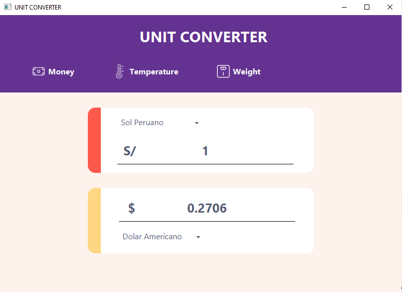
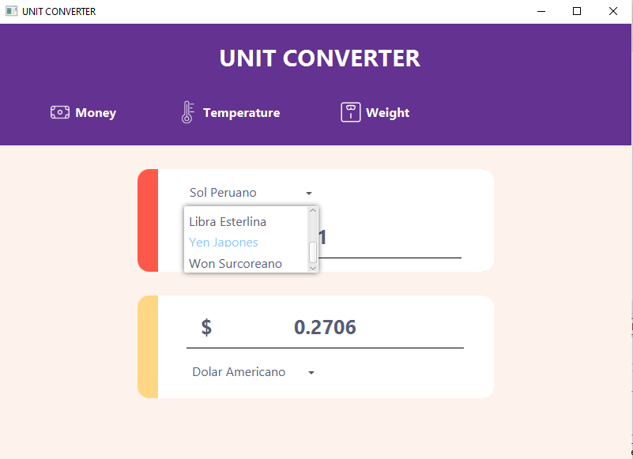
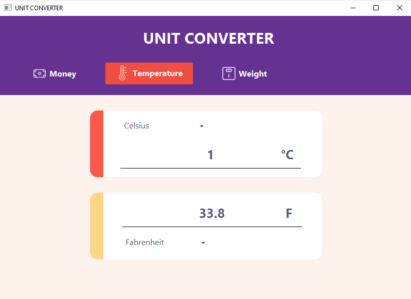

# UNIT CONVERTER

Esta es una aplicación creada con JavaFx que permite realizar conversiones de monedas, temperatura y pesos.

## Tabla de contenido

- [Descripción general](#descripción-general)
  - [Explicación](#explicación)
  - [Screenshot](#screenshot)
  - [Links](#links)
- [Mi proceso](#mi-proceso)
  - [Construido con](#construido-con)
  - [Aprendizaje](#aprendizaje)
  - [Desarrollo continuo](#desarrollo-continuo)
- [Autor](#autor)
- [Agradecimiento](#agradecimiento)


## Descripción general

### Explicación

Los usuarios deben ser capaces de:

- Convertir el tipo de moneda a las otras opciones mostradas
- Realizar conversiones de otro tipo como temperatura y peso
- Solo introducir números dentro de la aplicación y no letras o caracteres extraños

### Screenshot

**Vista desde un celular**




**Vista cambiando del tipo de conversión**




**Vista seleccionando una opción de conversión**





### Links

- Solution URL: [Github](https://github.com/AngelQP/Conversor-Monedas-Alura.git)

## Mi proceso

### Construido con

- Java
- JavaFx

### Aprendizaje

En esta ruta de aprendizaje al usar Java aprendí el uso de JavaFx que me permite crear aplicaciones con un diseño más moderno y con mejor personificación a gusto del cliente como del desarrollador, me permitió abarcar distintos conceptos de POO como polimorfismo y herencia.

A continuación una parte del código de CSS en FXML que me resulto muy sorprendete esta nueva manera de aplicarlo a aplicaciones de escritorio.

```CSS
.combo-box-popup .list-view 
{
    -fx-background-color: white, white;
    -fx-background-insets: 0, 1;
    -fx-effect: dropshadow( three-pass-box , rgba(0,0,0,0.6) , 8, 0.0 , 0 , 0 );
} 
```

### Desarrollo continuo

Mejorar mi nivel de programación estructurada a objetos, permitiendo abstraer mas mis conocimientos y desarrollorar mejores aplicativos.

## Autor

- Website - [Angel Quispe](https://portafolio-principal-8fr6.onrender.com/)
- Github - [@AngelQP](https://github.com/AngelQP)

## Agradecimiento

"El éxito se encuentra en lograr cada día un pequeño objetivo"

